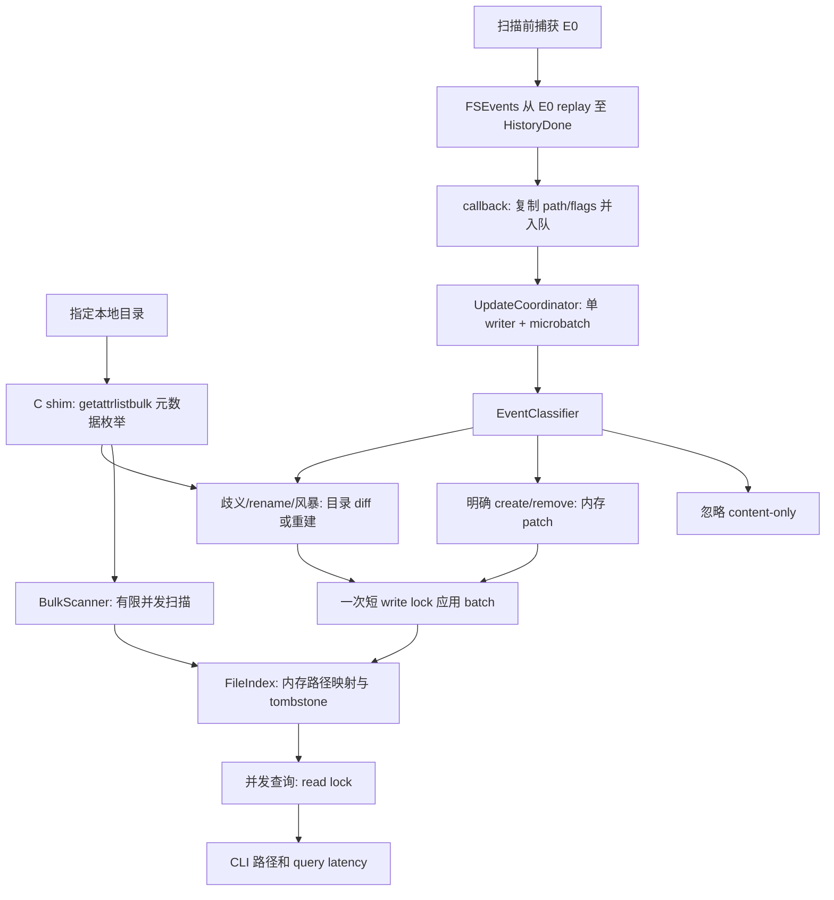

# apfsfind v0.1.0

macOS 本地文件名搜索工具的 Sprint 1 工程原型。全量扫描指定目录，在内存中建立索引，再通过 FSEvents 维护创建、删除和重命名。搜索大小写不敏感，按文件名子串匹配，exact、prefix、普通 substring 依次排序，默认最多返回 50 个完整路径。

本版交付 CLI、核心库、C shim、正确性测试和 benchmark，重点测量实时维护延迟、内容写入的 CPU 放大以及 reconciliation 的恢复能力。实际验证结果见 [STATUS.md](STATUS.md)。

## 构建和使用

需要 macOS 14+、Swift 6 和 macOS SDK。使用 Swift Package Manager，无第三方 Swift package 依赖。在项目目录运行：

```bash
swift build -c release
swift test
swift run -c release apfsfind serve --root "$HOME" --latency-ms 20
```

也可直接运行构建产物：

```bash
.build/release/apfsfind serve --root /Users/yourname/projects --workers 4
.build/release/apfsfind
.build/release/apfsfind --help
```

默认命令是 `serve`，默认 root 是 `$HOME`。`--latency-ms` 允许 1–1000 ms，`--workers` 允许 1–16，默认 4。启动时分别显示扫描和内存索引构建进度、耗时；从扫描前捕获的事件 ID 完成 replay 和必要恢复后进入交互搜索。大目录启动没有固定 10 秒限制，等待期间每秒报告实际状态和事件处理进度，可随时 Ctrl+C 取消；真实启动失败或自动恢复重试暂停仍会返回错误。benchmark 保留有界等待。

输入普通文本执行查询，每次显示路径、query latency 和 generation。内置命令：

| 命令 | 行为 |
| --- | --- |
| `:stats` | entries、live entries、tombstones、事件/更新/重建计数、队列高水位、最近 batch、generation、状态、RSS、user/system CPU 和配置阈值 |
| `:verify` | 独立 fresh scan，与在线索引比较 path set；输出 missing/extra，最多显示 20 个差异；不修改索引 |
| `:rebuild` | 后台建立替代索引，完成后交换；期间继续查询旧索引 |
| `:quit` | 停止 watcher 和 worker，退出 |

Ctrl+C 同样停止后台任务。搜索、统计和 benchmark 输出至 stdout；扫描进度、info/debug/error 至 stderr。程序不写日志文件。事件 debug 默认关闭，临时启用方式：

```bash
APFSFIND_DEBUG_EVENTS=1 .build/release/apfsfind serve --root "$HOME"
```

高频事件测试应保持 debug 关闭，避免终端输出影响测量。

## 安全和扫描边界

- 不访问 raw disk、`/dev/disk*` 或 `/dev/rdisk*`，不需要 root，不使用 helper，不修改 SIP。
- 仅读取目录项和基础元数据；搜索器不读取文件内容，不做全文索引，不主动下载 iCloud 文件内容。
- 目录通过 `O_RDONLY | O_DIRECTORY | O_CLOEXEC | O_NOFOLLOW` 打开；枚举使用 `getattrlistbulk()` 和 `FSOPT_NOFOLLOW`。C shim 对 packed buffer 长度、偏移和属性边界做检查。
- 扫描 root 显式 canonicalize 一次；子目录不跟随符号链接。符号链接本身被索引，不递归进入。
- 默认只遍历 root 的 device，跳过下级挂载点和 automount trigger；使用缓存挂载信息拒绝网络文件系统和 autofs。指定 `/` 时仍受这些边界限制，不能视为完整系统盘索引。
- 每个扫描线程 best-effort 设置关闭 dataless materialization 的 I/O policy。SDK 缺少相关常量时编译期安全降级；运行失败或不支持通过 `dataless_policy_errors` / `dataless_policy_unavailable` 计数。此时仍保持只读元数据路径，不尝试读取内容来触发下载。
- 显式 root 用有界 metadata-only symlink 解析，在访问目标前检查本地挂载；目录打开前检查 SDK 支持的 dataless 标志并跳过占位目录（`scanner_dataless_skips`），无需让占位内容下载。
- `ENOENT` 等正常扫描 race 可容忍；`EACCES` / `EPERM` 计数并继续处理其他目录。无法打开 scan root 时明确报错。
- 正常运行不创建持久索引、snapshot、WAL 或日志文件，不建立网络连接，不收集 telemetry。benchmark 的写入和删除仅发生在程序自己创建的临时目录。

## 权限

普通可读目录无需额外授权。`$HOME` 中的部分目录受 macOS 隐私权限保护；出现不可读目录时，先检查 `:stats`。如需索引受保护位置，可在“系统设置 → 隐私与安全性 → 完全磁盘访问权限”中为实际启动工具的终端或宿主应用授权，再重启该应用。权限由用户决定，工具不会自动授予权限，也不绕过文件权限。参见 [Apple 的隐私与安全性设置说明](https://support.apple.com/guide/mac-help/mchl211c911f/mac)。本版无需 Apple Developer 签名、notarization 或安装系统扩展。

## 当前架构



索引使用 `ContiguousArray<FileEntry>`、path/directory 映射、parent/children 关系和 generation。删除目录会 tombstone 整个子树；发现新目录会扫描其当前子树。目录读取和 diff 在 write lock 外进行，mutation batch 一次加锁应用。full rebuild 在独立索引中完成，再短暂加锁交换。

明确的普通文件创建和删除走低延迟 patch；普通 content-only 事件不执行 `lstat()`、索引修改或目录扫描。rename 和 compound flags 聚合 dirty parent 后 reconcile，不依赖 rename event 的配对顺序。mtime gate 使用纳秒目录时间戳减少重复读取，显式 namespace 变化会强制检查；它不是唯一正确性依据。MustScanSubDirs、流失效和队列溢出触发 subtree reconciliation 或后台 rebuild。

所有阈值集中在 `APFSFindConfiguration`，并显示在 `:stats` 中：

| 配置 | 默认值 |
| --- | --- |
| FSEvents latency | 20 ms |
| 初始扫描 worker | 4 |
| `directPatchBatchLimit` | 256 events |
| `dirtyParentLimit` | 64 directories |
| `microBatchWindowMilliseconds` | 5 ms |
| `fullRebuildMinInterval` | 30 s |
| `rebuildDebounceMilliseconds` | 100 ms |
| `maxPendingEvents` | 100000 events |
| `maxConsecutiveRebuildFailures` | 8 |

大 batch 聚合 parent、去重并合并祖先目录；dirty parents 过多时升级为 root rebuild。增量流失效时保留旧索引供查询，后台重建遵守最短间隔和指数退避；连续 8 次失败后暂停自动重建，避免无限循环。手动 `:rebuild` 重置失败计数并解除暂停，仍遵守 30 秒最短间隔。

第一版刻意不持久化：先验证维护正确性、延迟和 CPU，再决定 snapshot 格式及内存压缩方案。当前 event ID 仅在本次进程中使用，是 host-level ID；不保存跨重启 cursor。

## 测试和 benchmark

```bash
swift test
swift run -c release apfsfind bench --files 1000 --latency-ms 20
```

本机 FSEvents 集成测试默认运行，所有集成测试只操作临时目录。CI 或受限环境确实不能运行 FSEvents 时可显式跳过：

```bash
APFSFIND_SKIP_FSEVENTS_TESTS=1 swift test
```

benchmark 不接受 `--root`。它创建系统 temporary directory 下的独占子目录；清理前再次校验 canonical parent、精确目录名和目录类型，拒绝删除其他位置。`--files` 默认 10000，用于 create/delete storm。

每次 benchmark 包含：100 个 create 样本、100 个 delete 样本、各 100 个同目录和跨目录 rename 样本、同一文件 10000 次内容 write，以及 `--files` 个小文件的创建和删除风暴。单次操作完成后轮询查询，记录真实可见延迟，不通过人为延迟让断言通过；单操作硬超时为 2 秒。风暴采用有界 convergence 等待，随后独立 verify。

输出人类可读 summary；最后一行是单行 JSON，包含 min、median、p90、p95、p99、max、completed samples、timeouts、CPU、metric deltas、verify 结果和 acceptance。分位数采用 nearest-rank，timeout 不混入已完成样本统计。结果不写文件。

provisional acceptance 要求各延迟 workload 完成 100 个样本、无超时、p95 < 500 ms；两次 storm 均收敛且 verify missing=0 / extra=0；内容写入后实际观察到被忽略的事件，entry count、generation 不变，没有 direct patch / reconciliation / full rebuild。内容写入分别报告 write loop 和包含事件观察等待的总耗时/CPU。事件 flush 仅用于 workload 之间的排空，不用于单操作延迟测量。未达标返回非零退出码；具体实测见 [STATUS.md](STATUS.md)。

## 已知限制和后续范围

- `:verify` 是独立扫描，不是原子磁盘 snapshot；应在被测目录停止变化并等待事件收敛后比较。并发修改可能产生暂时差异。
- FSEvents 可合并事件，latency 参数不保证送达期限；实际延迟取决于本机负载、权限和文件系统。不可读目录无法被完整索引。
- 删除记录的 tombstone 会累积，直到 rebuild 替换索引。搜索采用简单线性遍历，保留完整 path 以优先保证可验证性；大目录的内存和查询成本尚未优化。
- 当前边界优先保证 `$HOME`、`/Users/...` 和普通本地目录；不提供 system-wide multi-volume indexing。
- 后续候选包括 per-device FSEvents stream、FSEvents UUID、persistent cursor/snapshot、Extended File ID rename pairing、packed string arena 和 mmap index。
- 本版不提供 GUI、global hotkey、全文索引、APFS 原始解析、FileVault 解密、APFS snapshot 解析、`searchfs()`、Endpoint Security、自动更新、复杂倒排索引或数据库持久化。
